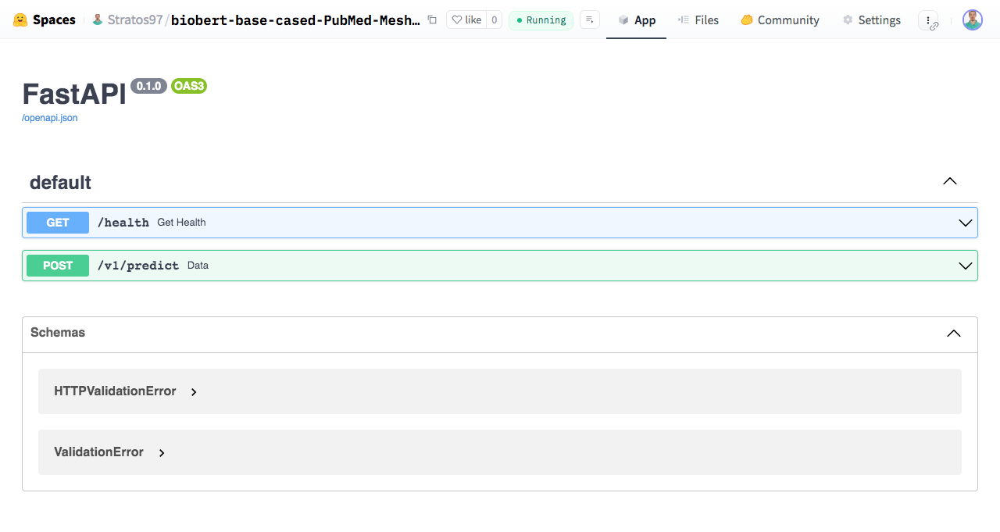

# AtyponAssignment

## Exploratory Data Analysis (EDA)

## Experiments
Our experimentation procedure included multiple models. 
We began with Logistic Regression to establish benchmarks, 
proceeded with a MultiLayer Perceptron (MLP) and performed hyperparameter tuning, 
and concluded with the use of Transformers, specifically BERT and a pre-trained model in the biomedical domain. 
We observed that this pre-trained model demonstrated the best performance.

### 1. Logistic Regression
Logistic regression models are inherently designed to handle binary classification problems, where the target vector contains only two classes. 
However, there are three extensions to logistic regression that can be used for multi-label classification, where the target vector has more than two classes:

* **One-vs-Rest (OvR) Multiclass Strategy**: This strategy involves fitting one classifier per class, where each classifier is trained to distinguish the samples of a single class versus all other classes.
* **One-vs-One (OvO) Multiclass Strategy**: This strategy involves fitting a classifier for every pair of classes, where each classifier is trained to distinguish between two classes.
* **Multinomial Method**: This method extends logistic regression to handle multiple classes directly, rather than decomposing the problem into multiple binary classification tasks.

We did not proceed with exhaustive experimentation since our goal was to establish a baseline. 
We employed only the One-vs-Rest methodology, and the classification report is shown below. 
It should be noted that although the results appear promising, it is important to remember that we do not have a single classifier in this case. 
Instead, we have 14 classifiers, one for each label.
```text
              precision    recall  f1-score   support

           A       0.81      0.76      0.78      4606
           B       0.95      1.00      0.97      9276
           C       0.87      0.84      0.85      5284
           D       0.90      0.90      0.90      6157
           E       0.81      0.96      0.88      7842
           F       0.87      0.63      0.73      1762
           G       0.83      0.89      0.86      6660
           H       0.64      0.10      0.18      1272
           I       0.73      0.43      0.54      1159
           J       0.78      0.29      0.42      1141
           L       0.77      0.36      0.49      1486
           M       0.87      0.88      0.88      4280
           N       0.81      0.78      0.79      4519
           Z       0.77      0.54      0.64      1651

   micro avg       0.86      0.82      0.84     57095
   macro avg       0.82      0.67      0.71     57095
weighted avg       0.85      0.82      0.82     57095
 samples avg       0.86      0.83      0.83     57095
```

### 2. MultiLayer Perceptron (MLP)
Following our baseline experimentation with Logistic Regression, we explored the performance of a MultiLayer Perceptron (MLP).
MLPs are a class of feed forward artificial neural networks that consist of multiple layers of nodes, each fully connected to the next layer. 
These models are capable of capturing complex patterns in the data due to their deep structure.

To optimize the MLP's performance, we conducted hyperparameter tuning using the ```KerasTuner``` librabry and ```Hyperband``` algorithm. 
The best results of this tuning process are presented below:
```text
              precision    recall  f1-score   support

           A       0.83      0.46      0.59      4606
           B       0.93      1.00      0.96      9276
           C       0.74      0.85      0.79      5284
           D       0.75      0.91      0.82      6157
           E       0.78      1.00      0.88      7842
           F       0.65      0.42      0.51      1762
           G       0.72      0.94      0.82      6660
           H       0.00      0.00      0.00      1272
           I       0.72      0.16      0.26      1159
           J       1.00      0.00      0.00      1141
           L       0.00      0.00      0.00      1486
           M       0.79      0.89      0.84      4280
           N       0.69      0.75      0.72      4519
           Z       0.60      0.16      0.26      1651

   micro avg       0.78      0.77      0.78     57095
   macro avg       0.66      0.54      0.53     57095
weighted avg       0.75      0.77      0.73     57095
 samples avg       0.78      0.78      0.77     57095
```

### 3. Bert-based models
Building on the foundation of our previous experiments, we leveraged BERT-based models to further enhance performance. 
BERT (Bidirectional Encoder Representations from Transformers) is a powerful transformer-based model with a big capacity, able to tackle various natural language processing tasks.

In our experiments, we utilized two variants:

* ```bert-base-uncased```: A general-purpose BERT model that has been pre-trained on a large corpus of English text, providing robust language understanding capabilities.
* ```BioBERT```: A specialized variant of BERT that has been pre-trained on PubMed articles, making it particularly effective for biomedical text classification tasks.

Below we can see the results of ```bert-base-uncased``` and ```BioBERT``` respectively:

```text
BERT
              precision    recall  f1-score   support

           A       0.23      0.00      0.01      4606
           B       0.93      1.00      0.96      9276
           C       0.53      1.00      0.69      5284
           D       0.53      0.06      0.10      6157
           E       0.78      1.00      0.88      7842
           F       0.22      0.05      0.09      1762
           G       0.68      0.02      0.03      6660
           H       0.00      0.00      0.00      1272
           I       0.00      0.00      0.00      1159
           J       0.00      0.00      0.00      1141
           L       0.00      0.00      0.00      1486
           M       0.43      0.99      0.60      4280
           N       0.36      0.19      0.25      4519
           Z       0.00      0.00      0.00      1651

   micro avg       0.64      0.49      0.56     57095
   macro avg       0.33      0.31      0.26     57095
weighted avg       0.53      0.49      0.42     57095
 samples avg       0.65      0.49      0.55     57095
```

```text
BioBERT
              precision    recall  f1-score   support

           A       0.77      0.81      0.79      4606
           B       0.96      0.99      0.97      9276
           C       0.88      0.83      0.85      5284
           D       0.86      0.94      0.90      6157
           E       0.82      0.95      0.88      7842
           F       0.78      0.75      0.76      1762
           G       0.80      0.90      0.85      6660
           H       0.60      0.07      0.12      1272
           I       0.66      0.55      0.60      1159
           J       0.53      0.50      0.52      1141
           L       0.69      0.37      0.48      1486
           M       0.85      0.90      0.87      4280
           N       0.83      0.73      0.78      4519
           Z       0.73      0.60      0.66      1651

   micro avg       0.83      0.84      0.84     57095
   macro avg       0.77      0.71      0.72     57095
weighted avg       0.83      0.84      0.82     57095
 samples avg       0.84      0.84      0.83     57095
```
The BioBERT model achieved the best performance among the models we tested. 
Consequently, we decided to upload this model to HuggingFace Hub, where it is available [here](https://huggingface.co/Stratos97/biobert-base-cased-PubMed-Mesh). 
This is the model used in the API described in the section below.

## API
An API has been created using the ```FastAPI``` and ```Uvicorn``` libraries. 
Below, you can find instructions on how to run it locally or use the deployed version directly.

**Local usage:**
1. Start the FastAPI application:
    ```bash
    cd AtyponAssignment/api
    uvicorn api:app --reload
    ```
    By default, the application will be hosted at ```http://127.0.0.1:8000/```. <br>
    The implemented endpoints are:
    * ```/```: Provides basic information about the API. In this case, it returns ```{"message": "Machine Learning service"}```
    * ```/health```: Used to check whether the service is operational. In this case, it returns ```{"message": "OK"}```
    * ```/v1/predict```: The main endpoint responsible for making predictions. 
2. Test the API using ```curl```:
    ```bash
    curl -H "Content-Type: application/json" -X POST -d '{"text":"A case of a patient with type 1 neuroromatosis associated with popliteal and coronary artery aneurysms is described in which cross-sectional\nimaging provided diagnostic information. The aim of this study was to compare the exercise intensity and competition load during Time Trial (TT),\nFlat (FL), Medium Mountain (MM) and High Mountain (HM) stages based heart rate (HR) and session rating of perceived exertion (RPE).METHODS:\nWe monitored both HR and RPE of 12 professional cyclists during two consecutive 21-day cycling races in order to analyze the exercise intensity and competition load (TRIMPHR and TRIMPRPE).\nRESULTS:The highest (P<0.05) mean HR was found in TT (169±2 bpm) versus those observed in FL (135±1 bpm), MM (139±3 bpm), HM (143±1 bpm)"}' http://127.0.0.1:8000/v1/predict
    ```
    Response:
    ```json
    {      
      "STATUS":"OK",
      "RESPONSE": {
        "article": "A case of a patient with type 1 neuroromatosis associated with popliteal and coronary artery aneurysms is described in which cross-sectional\nimaging provided diagnostic information. The aim of this study was to compare the exercise intensity and competition load during Time Trial (TT),\nFlat (FL), Medium Mountain (MM) and High Mountain (HM) stages based heart rate (HR) and session rating of perceived exertion (RPE).METHODS:\nWe monitored both HR and RPE of 12 professional cyclists during two consecutive 21-day cycling races in order to analyze the exercise intensity and competition load (TRIMPHR and TRIMPRPE).\nRESULTS:The highest (P<0.05) mean HR was found in TT (169±2 bpm) versus those observed in FL (135±1 bpm), MM (139±3 bpm), HM (143±1 bpm)",
        "scores": {
          "Named Groups [M]": 0.9950736165046692,
          "Organisms [B]": 0.9930197596549988,
          "Analytical, Diagnostic and Therapeutic Techniques, and Equipment [E]":0.8981314301490784,
          "Phenomena and Processes [G]": 0.8844825625419617,
          "Diseases [C]": 0.8118777275085449,
          "Health Care [N]": 0.7473238110542297,
          "Anatomy [A]": 0.6173810362815857,
          "Psychiatry and Psychology [F]": 0.5503154993057251,
          "Anthropology, Education, Sociology, and Social Phenomena [I]": 0.5282009243965149,
          "Chemicals and Drugs [D]": 0.44657811522483826,
          "Technology, Industry, and Agriculture [J]": 0.17374999821186066,
          "Geographicals [Z]": 0.15315715968608856,
          "Disciplines and Occupations [H]": 0.06349503993988037,
          "Information Science [L]": 0.06157442554831505
        }
      }
    }
    ```

<br>

**Remote Usage:** <br>
The api is also deployed in a HuggingFace [space](https://huggingface.co/spaces/Stratos97/biobert-base-cased-PubMed-Mesh-api) 
using a Docker container. It is accessible by anyone who wishes to test it.


To access the API, use the same command as for local usage, but update the URL to: 
```text
https://stratos97-biobert-base-cased-pubmed-mesh-api.hf.space/v1/predict
```
You can test the API by using the following ```curl``` command: 
```bash
curl -H "Content-Type: application/json" -X POST -d '{"text":"A case of a patient with type 1 neuroromatosis associated with popliteal and coronary artery aneurysms is described in which cross-sectional\nimaging provided diagnostic information. The aim of this study was to compare the exercise intensity and competition load during Time Trial (TT),\nFlat (FL), Medium Mountain (MM) and High Mountain (HM) stages based heart rate (HR) and session rating of perceived exertion (RPE).METHODS:\nWe monitored both HR and RPE of 12 professional cyclists during two consecutive 21-day cycling races in order to analyze the exercise intensity and competition load (TRIMPHR and TRIMPRPE).\nRESULTS:The highest (P<0.05) mean HR was found in TT (169±2 bpm) versus those observed in FL (135±1 bpm), MM (139±3 bpm), HM (143±1 bpm)"}' https://stratos97-biobert-base-cased-pubmed-mesh-api.hf.space/v1/predict
```
